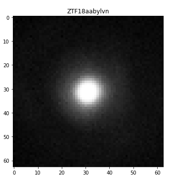
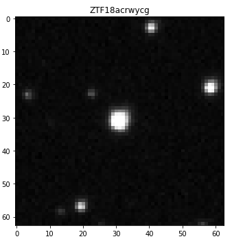
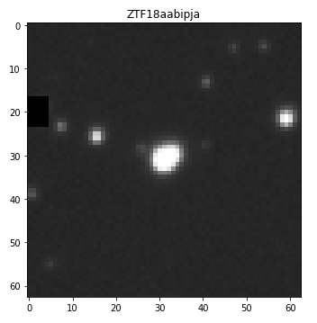
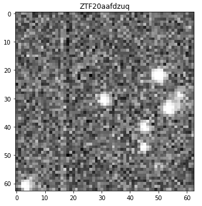

# Image Classification

This module performs a classification of alerts based on image visual content. It uses only the cutoutScience image and returns a single string label which describes image alert class. 

# Procedure

The image classification performs in three steps :
* Filter images that are noisy and/or corrupted (corrupted image contains Nan based on python definition of Nan)

* All images that are not noisy and not corrupted are binarized with a threshold computed by the triangle_thershold method from scikit_image library
then binary images which contain only small regions are categorized as star else they go to the third step

* Final step uses the chan_vese algorithm to segment images and produce again a binary image. 
All binary images which contain at least one large region will be categorized as extend, the other will be categorize as star.

# Added values

This module adds one new columns for ZTF data:

| labels  |
|---------|
| str     |

The labels added by the classification are 'safe_noisy', 'corrupted_noisy', 'corrupted_clear', 'safe_clear_star', 'safe_clear_extend'

# Classification Example

|  image classified as extend      |    image classified as star    |   image classified as corrupted      |    image classified as noised        |
|----------------------------------|--------------------------------|--------------------------------------|--------------------------------------|  
| | |   |       |

# Limitation and future upgrades

* Currently, the alerts labelised as corrupted and noised are ignored by the classifier
* The classification is based on the size of segmented regions, no information is provided for the shape of the object
* The noise estimation used during the process is not well documented
* A significant number of false positive can passed the classification. They include especially close variable stars or objects observed when the PSF was quite large.

