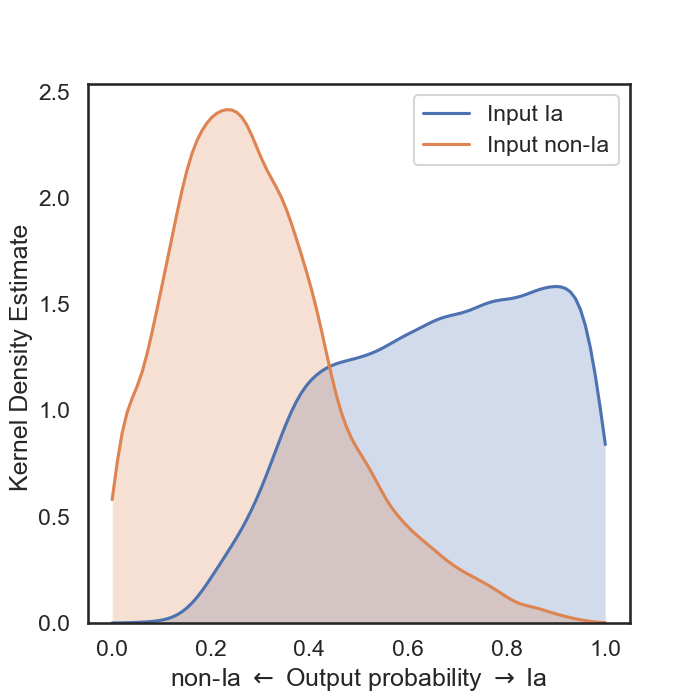
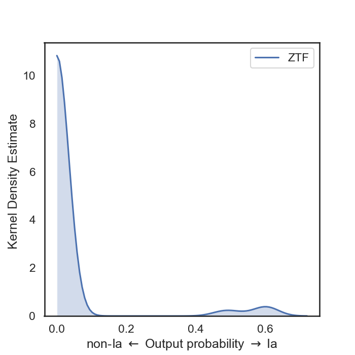

# Random Forest Classifier

This module returns the probability of an alert to be a SNe Ia using a Random Forest Classifier (binary classification). It benefits from the work in [Ishida et al](https://arxiv.org/abs/1804.03765). The module implicitly assumes that the model has been pre-trained, and it is loaded on-the-fly by all executors (the model is currently ~20 MB).

## Pipeline

The pipeline is very simple for the moment:
- extract time, magnitude, and filter information from alerts
- transform magnitude into flux
- for each alert, and for each filter, perform a Bazin fit to estimate the parameters `[A, B, t0, tfall, trise]`
- Load a pre-trained model (Random Forest), and for each alert estimate the probability to be a SNIa.

The condition to run the fit is to have at least 5 valid measurements in a given filter. Note that we give a probability of 0 (i.e. non-Ia) if an alert has not enough measurements in all of its bands.


## Input data for training (v0)

The input data set is SNPCC (DES) that has been _alertified_. It contains 21,319 light-curves with Ia, Ib, Ic, and II. The light-curves typically span several months, with 4 observation filters (g, r, i, z). To make it more realistic in our runs, we degraded the light-curve to look like ZTF alert data: 30 days, and 3 observation filters (g, r, i). Here is the kernel density for the output probability:



## Model distribution

The distribution of the model is currently done via CVMFS (i.e. it is pre-loaded on CVMFS, and each executor can see it).

## Typical call

You would use the classifier the following way:

```python
from pyspark.sql import functions as F
from fink_science.random_forest_snia.processor import rfscore

def concat_col(df, colname, prefix='c'):
    """ Add new column to the DataFrame named `prefix`+`colname`, containing
    the concatenation of historical and current measurements.
    """
    return df.withColumn(
        prefix + colname,
        F.concat(
            df['prv_candidates.{}'.format(colname)],
            F.array(df['candidate.{}'.format(colname)])
        )
    )


# Load alert data in a DataFrame
df = ...

# Where the model is stored
model_path = ...

# Required alert columns
what = [
    'jd', 'fid', 'magpsf', 'sigmapsf',
    'magnr', 'sigmagnr', 'magzpsci', 'isdiffpos']

# Use for creating temp name
prefix = 'c'
what_prefix = [prefix + i for i in what]

# Append temp columns with historical + current measurements
for colname in what:
    df = concat_col(df, colname, prefix=prefix)

# Perform the fit + classification
args = [F.col(i) for i in what_prefix] + [F.lit(model_path)]
df = df.withColumn('pIa', rfscore(*args))

# Drop temp columns
df = df.drop(*what_prefix)

df.select(['objectId', 'pIa']).show(3)
# +------------+-----+
# |    objectId|  pIa|
# +------------+-----+
# |ZTF19abagehm|  0.0|
# |ZTF19abjmimq|  0.0|
# |ZTF18abdlhrp|0.606|
# +------------+-----+
# only showing top 5 rows
```

Too bad, in this example the object with a probability of 0.6 is in reality a variable star (but look at the [spectra](https://lasair.roe.ac.uk/object/ZTF18abdlhrp/), very SN-like!). We need more work!

Here is the distribution of probabilities for a given run (a priori no SN Ia):



Not bad after all, but we need more work to clean the high probability outliers.

## Todo

- Use ZTF data to train the model. Difficulty: we need labels, but those labels can be found in Lasair for example.
- Use external information (i.e. other than light-curve) to increase the confidence.
- Use other kind of classifiers, and/or non-binary classification (all SN types for example). We could also use different fitting function (Bazin seems OK for well sampled light-curve with full shape).
