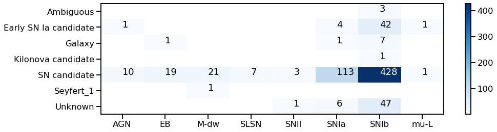
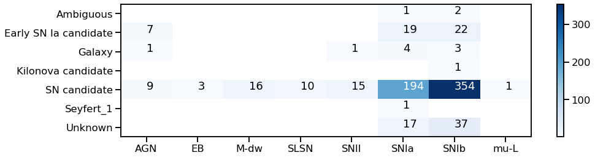
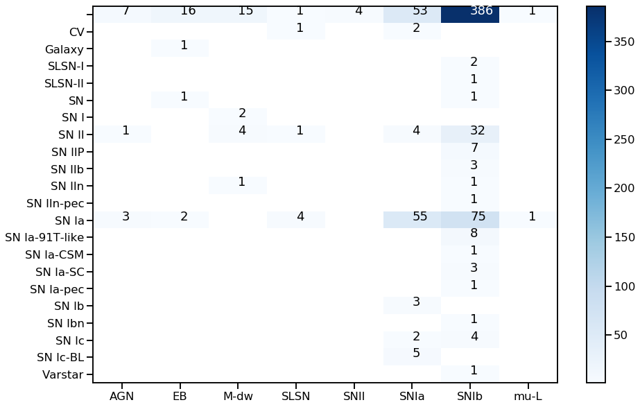
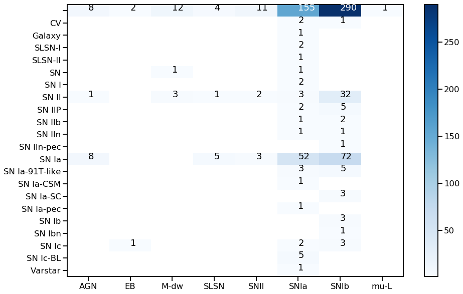

## T2 science module

_2022/04/25: initial import (v1)_

This science module is based on the work of [arxiv:2105.06178](https://arxiv.org/abs/2105.06178). We make use of the (currently private) astronet library. The classifier is trained against several classes:

```python
class_names = [
    "mu-Lens-Single",
    "TDE",
    "EB",
    "SNII",
    "SNIax",
    "Mira",
    "SNIbc",
    "KN",
    "M-dwarf",
    "SNIa-91bg",
    "AGN",
    "SNIa",
    "RRL",
    "SLSN-I",
]
```

## Selection cuts

The first step is to filter out unwanted transients based on ad-hoc arguments (number of measurements, known classification, etc.). The list of cuts can be found in [utilities.py](utilities.py).


## Inference

The second step is the inference. For simplicity, we output the class with the maximum probability:

```python
import pyspark.sql.functions as F
from fink_science.t2.processor import t2_max_prob

df = spark.read.format('parquet').load(...)

args = ['candid', 'cjd', 'cfid', 'cmagpsf', 'csigmapsf']
args += ['roid', 'cdsxmatch', 'candidate.jdstarthist']
df = df.withColumn('t2_class', t2_max_prob(*args))

df\
  .select(['objectId', 'class', 't2_class', 'pIa_atx'])\
  .filter(df['class'] == 'Early SN Ia candidate')\
  .show(8)
+------------+--------------------+--------+
|    objectId|               class|t2_class|
+------------+--------------------+--------+
|ZTF21acjnajt|Early SN Ia candi...|    SNIa|
|ZTF21ackvztp|Early SN Ia candi...|    SNIb|
|ZTF21ackqual|Early SN Ia candi...|    SNIb|
|ZTF21acjtxgr|Early SN Ia candi...|    SNIb|
|ZTF21acjrfhr|Early SN Ia candi...|    SNIa|
|ZTF21aclizab|Early SN Ia candi...|    SNIb|
|ZTF21ackqbow|Early SN Ia candi...|     AGN|
|ZTF21acjniho|Early SN Ia candi...|    SNIb|
+------------+--------------------+--------+
only showing top 8 rows
```

It is probably not the wisest choice on the long-term, but the simplest to start with.

## Available models

Two models are distributed with the repository:
- t2 (model id = 23057-1642540624-0.1.dev963+g309c9d8)
- atx (model id = 206145-1644662345-0.3.1.dev36+gfd02ace)

## Comparison with current classification

We loaded one full night of alert data (2022/04/24 -- 161,462 alerts). After applying selection cuts, 715 alerts were sent for inference. For these alerts, we compared the output of T2 (class with maximum probability) and the classification given by Fink given the current science modules.

### T2 vs Fink classification



### ATX vs Fink classification



### Discussion

#### Initial run - 2022/04/25

If we compare the output of T2 (class with maximum probability) and the classification given by Fink given the current science modules (see plots above), we notice that there is a correlation between the `SN candidate` class from Fink, and nearly all classes in T2. The biggest correlation is between `SN candidate` and `SNIb`, and then come `SNIa`. The class `SNIb` shows some non-negligible correlation with `Early SN Ia candidate`, which is somehow unexpected.

We can also see that T2 brings new predictions (`Unknown` class in Fink), but with still a large preference for the `SNIb` class.

We can play the same game by correlating the prediction from T2 (x-axis) and the spectroscopic data from TNS (y-axis):

#### T2 vs TNS



#### ATX vs TNS



We can see that the most represented class from T2 is `SNIb`, while there is almost no Ib from TNS (mostly Ia and II). We need to understand this bias in T2 towards `SNIb` that does not seem real.
